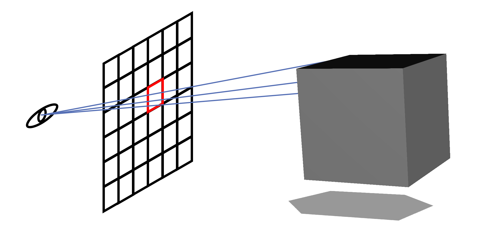
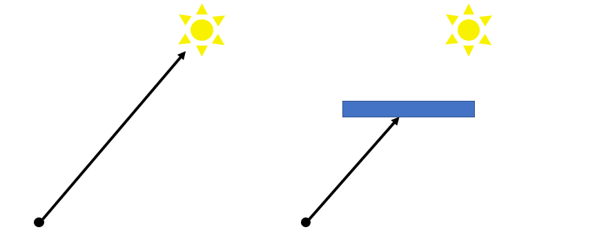
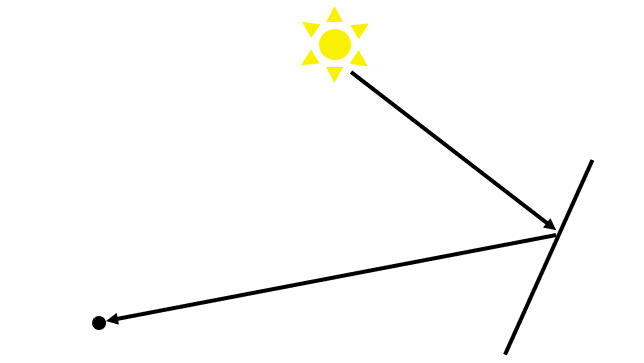
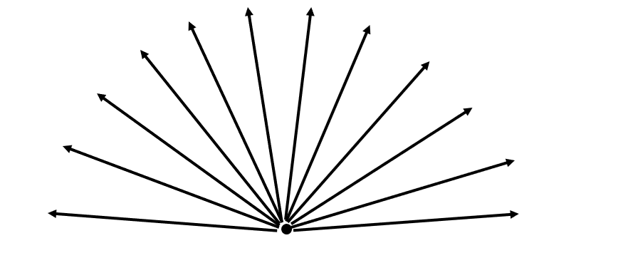
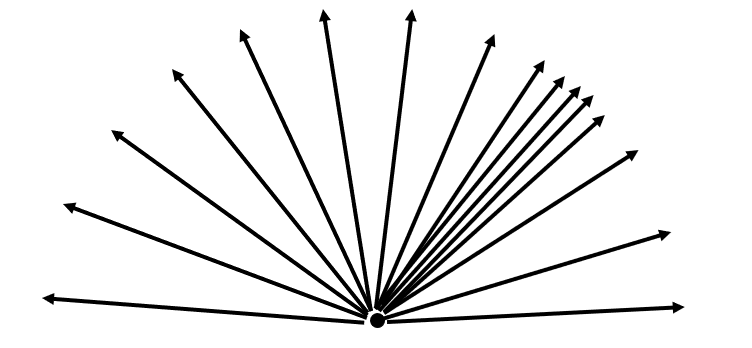

# Ray Tracing

## 介紹

使用 Ray Tracing 技術渲染場景，Ray Tracing 與平常使用 OpenGL 渲染方式不同點在於，Ray Tracing 模擬光到眼睛的路徑來產生結果，所以比起傳統的 OpenGL 相比，結果更為真實，且可以模擬玻璃、金屬等效果。
不過 Ray Tracing 的缺點在於，畫面所需時間遠超 OpenGL。

## 使用方式

點擊 Load 按鍵，在跳出的對話框中選擇要載入的 cpbrt 場景。

## 技術說明

### Ray Tracing 概念

眼睛是看的位置與方向，眼睛方向的方格是成像，為了計算成像上每一個像素的顏色，從眼睛往每個像素方向打出去，打到的物體顏色平均即是結果，不過這是在不考慮光的情況下。

為了考慮光，所以會從打到物體的位置，再打一條往光，來確認跟光之間是否有遮蔽物，如果有遮蔽物，則代表是影子(黑色的)，如果有打到則是原來的顏色。

到目前為止，只考慮到從光直接照到物體的貢獻，不過除此之外，還會有光打到物體再透過折射或反射，再打到目標位置的情況。

所以往各個方向打，檢查各個方向打的光

對於比較感興趣的部分會多打，來提高貢獻。像是鏡面、金屬等的部分。

### 實作

使用 Unity 的 Ray Tracing Shader 實作，主要是參考 [zhing2006
/
GPU-Ray-Tracing-in-One-Weekend-by-Unity-2019.3](https://zhing2006.github.io/GPU-Ray-Tracing-in-One-Weekend-by-Unity-2019.3/)，並且使用他們的 URP

每一次 Update，會往所有像素打一次，打到物體後，根據打到的物體材質，決定下一步是折射、漫反射、反射、結束的機率，再根據機率隨機選一種方式去打 (如果打多個方向 Unity 可能會崩饋)。

### Glass

根據 fresnel 等式，部分計算折射與反射的比例。

### AO

從一個點往各個方向打，在距離內打到東西的比例，如果比例越高則越黑，因為代表此位置能接收到光的機率越低。
